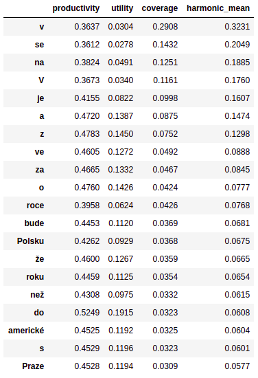
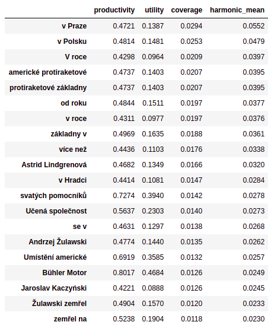
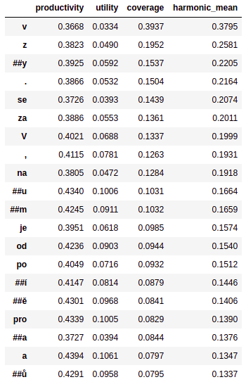
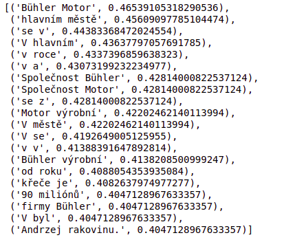

# Claims quality metrics
Simple script for calculation of claims quality metrics based on https://www.aclweb.org/anthology/2020.fever-1.6.pdf,
part of https://www.derczynski.com/itu/docs/fever-da_jubi_hens.pdf.

## Description
### Balanced dataset
This approach assumes a balanced dataset with regard to the frequency of each label. If executed on an imbalanced 
dataset, a given cue’s productivity would be dominated by the most frequent label, not because it is actually more 
likely to appear in a claim with that label but purely since the label is more frequent in overall.

It is used the same approach as in the paper above - undersampling majority classes and creating 10 folds of subsamples.
This enables more robust estimate.

### Cues are represented by unigrams, bigrams, wordpieces or skipgrams
<!-- Cue is the basic unit of text which bears a possible bias which enable  -->
Cue je zakladni jednotka textu, ktera nese mozny bias v datech, ktery ulehcuje ML rozhodovani.
Napriklad slovo 'not' v anglickych datech bude pritomno v claimech s timto rozdelenim podle labelu: 
80% REFUTES, 5% SUPPORTS, 15% NOT ENOUGH INFO - coz vypada na bias vuci REFUTES class; 
ML predikuje REFUTES vzdy v pripade pritomnosti 'not', a to s velmi slusnou accuracy. Nize spoctene metriky pomahaji 
odhalit takove patterny.
BertTokenizer from pretrained multilingual-bert-cased is used to get the wordpieces.

#### Skipgrams
Skipgrams are used as cues when calculating dataset-weighted cue information. Skipgrams are n-grams which enable to
skip some of the tokens (see below example).

Mini example:
Source sentence: Insurgents killed in ongoing fighting.

bi-grams = {insurgents killed, killed in, in ongoing, ongoing fighting}.
skip-2-bi-grams = {insurgents killed, insurgents in, insurgents ongoing, killed in, killed ongoing, 
                    killed fighting, in ongoing, in fighting, ongoing fighting}

tri-grams = {insurgents killed in, killed in ongoing, in ongoing fighting}.
skip-2-tri-grams = {insurgents killed in, insurgents killed ongoing, insurgents killed fighting, 
                    insurgents in ongoing, insurgents in fighting, insurgents ongoing fighting, 
                    killed in ongoing, killed in fighting, killed ongoing fighting, in ongoing fighting}.
Taken from: http://www.lrec-conf.org/proceedings/lrec2006/pdf/357_pdf.pdf

### Negations
Using *negation_only* argument results will contain only the negations that are extracted using MorphoDita tagger.

## Metrics Description
### Applicability
Applicability is the absolute number of claims in the dataset that contain the cue irrespective of their label
(=v kolika claimech je cue pritomna).

### Productivity
Productivity is the frequency of the most common label across the claims that contain the cue 
(=cetnost nejcastejsiho labelu pro cue). Productivity is in the range [1/3, 1] for 3 possible labels (supports, 
refutes, not enough info). In practical terms, the productivity is the chance that a model correctly labels a claim 
by assigning it the most common label of a given cue in the claim.

### Coverage
Coverage is an applicability of a cue / total number of claims (= v kolika claimech je cue pritomna / pocet claimu).

### Utility
Utility is only normalized Productivity. Interpretation for ML algorithm: the higher utility the easier decision for ML 
alg). 
In order to compare above metrics between datasets utility is the metric to go. 
A cue is only useful to a machine learning model if productivity_k > 1 / m, where m is the number of possible labels 
(=3; supports, refutes, not enough info).

### Dataset-weighted Cue Information (DCI)
Simple information theoretic measure of how much a pattern contributes to a classification weighted by document 
frequency bearing the skipgram (similar to idf in tf-idf).

## How to Read the Results
- productivity = how strong the potential bias is; in our case of the 3 labels -- 1/3 is a perfect randomness
- utility = adjusted productivity for cross dataset comparison
- coverage = how common/widespread is the cue
- harmonic mean = harmonic mean of productivity and coverage; the higher harmonic mean the higher risk of bias in the data
- DCI = the higher the bigger potential of bias in the data; 
        <!-- DCI = 1/3 means the cue provides no/very low information (no bias in the data)  -->

## Results

### Unigram top-20 sorted by harmonic mean (productivity, coverage)

### Bigram top-20 sorted by harmonic mean (productivity, coverage) 

### Wordpiece top-20 sorted by harmonic mean (productivity, coverage) 

### Skip-4-bigram top-20 sorted by DCI 
